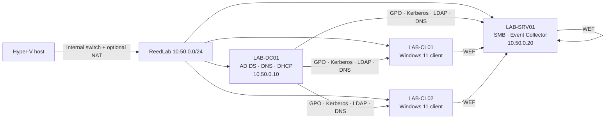

# ReedLab Active Directory Homelab


ReedLab is a four-VM Windows domain built to practise the work behind a real identity environment: directory structure, least-privilege access, Group Policy, Windows LAPS, file services, DNS/DHCP, event forwarding, and repeatable validation.

The default environment is deliberately fictional and isolated. It uses the reserved `corp.reedlab.test` namespace and `10.50.0.0/24`; it contains no workplace names, addresses, credentials, or infrastructure details.

> This is a learning and portfolio environment, not a production security baseline. Read each script and take VM checkpoints before applying changes.

## What it demonstrates

- New AD DS forest deployment with integrated DNS
- Idempotent OU, user, and group provisioning from versioned data
- AGDLP access design: users → global role groups → domain-local resource groups → ACLs
- Separate workstation, server, admin, service-account, and quarantine boundaries
- Password and lockout policy with no plaintext credentials in source
- Least-privilege departmental SMB shares with access-based enumeration and encryption
- Workstation/server GPOs for UAC, SMBv1 controls, Defender PUA protection, and PowerShell visibility
- Windows LAPS schema, encrypted password backup, delegated readers, and access auditing
- Source-initiated Windows Event Forwarding to a central collector
- A validation script that produces a recruiter-friendly pass/fail report
- Optional Hyper-V provisioning for the isolated virtual network and VM shells

## Architecture



| VM | Role | Address | Suggested OS |
|---|---|---:|---|
| `LAB-DC01` | AD DS, DNS, DHCP, Group Policy | `10.50.0.10` | Windows Server 2022/2025 Desktop Experience |
| `LAB-SRV01` | File server and Windows Event Collector | `10.50.0.20` | Windows Server 2022/2025 Desktop Experience |
| `LAB-CL01` | Domain workstation | DHCP | Windows 11 Pro/Enterprise |
| `LAB-CL02` | Domain workstation | DHCP | Windows 11 Pro/Enterprise |

The hypervisor owns `10.50.0.1` when optional NAT is enabled. Every domain member uses `10.50.0.10` for DNS.

## Requirements

- A machine with hardware virtualization enabled
- Hyper-V, VMware Workstation, VirtualBox, or Proxmox
- Two Windows Server evaluation VMs and two Windows 11 Pro/Enterprise VMs
- Roughly 20 GB RAM and 260 GB thin-provisioned disk capacity for the full lab
- Administrator access inside the disposable VMs
- PowerShell 5.1 or newer

The configuration scripts are hypervisor-neutral. `New-HyperVLab.ps1` is optional convenience automation for Hyper-V hosts.

## Build order

Start with [the full build guide](docs/build-guide.md). The short version is:

1. Create the isolated VMs. On Hyper-V, preview first:

   ```powershell
   .\scripts\New-HyperVLab.ps1 -ServerIso C:\ISO\Server.iso -ClientIso C:\ISO\Windows11.iso -CreateNat -WhatIf
   ```

2. Install Windows, apply updates, rename each VM, and set static addresses on `LAB-DC01` and `LAB-SRV01`.

3. On `LAB-DC01`, run the prerequisite check and build the forest:

   ```powershell
   .\scripts\00-Test-Prerequisites.ps1 -Role DomainController -Strict
   .\scripts\10-Install-Forest.ps1 -WhatIf
   .\scripts\10-Install-Forest.ps1 -Restart
   ```

4. After the restart, build the directory, DHCP, and security policies:

   ```powershell
   .\scripts\20-Build-Directory.ps1 -CreateSampleUsers -WhatIf
   .\scripts\20-Build-Directory.ps1 -CreateSampleUsers
   .\scripts\15-Configure-Dhcp.ps1
   .\scripts\50-Configure-SecurityBaseline.ps1 -ExtendLapsSchema
   .\scripts\60-Configure-EventForwarding.ps1 -Mode Policy
   ```

5. Join the member server and clients using `30-Join-Domain.ps1`, then configure the server:

   ```powershell
   .\scripts\40-Configure-FileServer.ps1 -WhatIf
   .\scripts\40-Configure-FileServer.ps1
   .\scripts\60-Configure-EventForwarding.ps1 -Mode Collector
   ```

6. Run event source setup on `LAB-SRV01`, `LAB-CL01`, and `LAB-CL02`, then validate from the DC:

   ```powershell
   .\scripts\60-Configure-EventForwarding.ps1 -Mode Source
   .\scripts\90-Validate-Lab.ps1 -ExportPath .\ReedLab-validation.csv
   ```

## Safety by design

- Deployment code refuses any configured domain other than `corp.reedlab.test`.
- Domain-aware scripts stop if the VM belongs to another domain.
- Role scripts enforce expected `LAB-*` computer names.
- Credentials are accepted only as `SecureString` or `PSCredential` objects.
- No passwords, hashes, tokens, real identities, or remote-access secrets are included.
- Mutating scripts support `-WhatIf`; forest creation is marked high impact.
- CSV identities are fictional demonstration records.
- The project contains defensive administration and monitoring only—no exploitation or credential-dumping tooling.

## Repository map

```text
config/                 Locked fictional lab topology and policy values
data/                   Fictional users and share definitions
modules/ReedLab/        Reusable safety and idempotency helpers
scripts/                Numbered deployment and validation stages
tests/                  Parser, fixture, and secret-hygiene checks
docs/                   Architecture, build, security, demo, and troubleshooting notes
.github/workflows/      Windows-based static validation
```

## Portfolio walkthrough

The fastest useful demonstration is six minutes: show the OU tree, explain one AGDLP permission path, prove a user can access one share but not another, display the LAPS permission model with the password value redacted, trigger a failed sign-in, and find that event in `ForwardedEvents`. Use [the demo script](docs/demo-script.md) and [screenshot checklist](docs/screenshots/README.md).

Do not claim the lab as deployed until you have run the validation and captured your own evidence. Honest [resume bullets](docs/resume-bullets.md) are included for both the code-only and deployed stages.

## Deliberate limits

- One DC keeps the resource cost reasonable; it does not demonstrate directory redundancy or restore operations.
- VM creation stops at the Windows installer instead of distributing unattended media or licence material.
- The GPOs demonstrate selected controls and logging; they are not a replacement for the full Microsoft Security Baselines.
- WEF provides central visibility but no alerting, immutable retention, or capacity tier.
- CI validates source structure and fixtures. Runtime proof must come from the Windows lab and the validation report.

A sensible next iteration is a second DC plus documented backup/restore testing, followed by protected event retention and alert rules.

## Documentation

- [Build guide](docs/build-guide.md)
- [Architecture and naming](docs/architecture.md)
- [Security model](docs/security-model.md)
- [Demo script](docs/demo-script.md)
- [Troubleshooting](docs/troubleshooting.md)
- [Resume bullets](docs/resume-bullets.md)

## Primary references

- [Install a new AD DS forest](https://learn.microsoft.com/en-us/windows-server/identity/ad-ds/deploy/install-active-directory-domain-services--level-100-)
- [Windows LAPS deployment scenarios](https://learn.microsoft.com/en-us/windows-server/identity/laps/laps-scenarios-windows-server-active-directory)
- [Windows LAPS policy settings](https://learn.microsoft.com/en-us/windows-server/identity/laps/laps-management-policy-settings)
- [Windows Event Forwarding troubleshooting](https://learn.microsoft.com/en-us/troubleshoot/windows-server/admin-development/events-not-forwarded-by-windows-server-collector)
- [Deploy DHCP with Windows PowerShell](https://learn.microsoft.com/en-us/windows-server/networking/technologies/dhcp/dhcp-deploy-wps)
- [Windows Server core network guide](https://learn.microsoft.com/en-us/windows-server/networking/core-network-guide/core-network-guide)

## Licence

The source is public for inspection and unmodified personal evaluation, but it is not open source. Modification, resale, rebranding, and commercial redistribution are prohibited. See [LICENSE](LICENSE).
