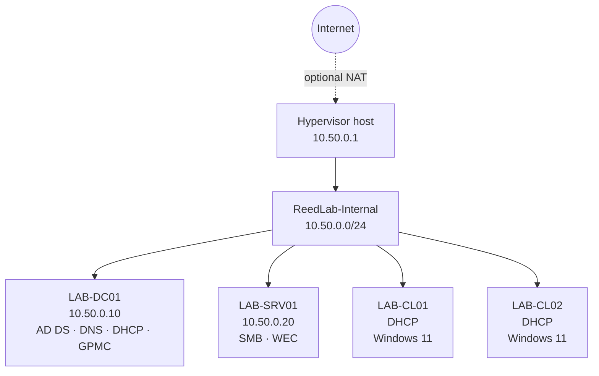
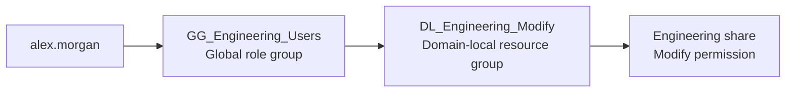

# Architecture and naming

## Design goal

ReedLab is small enough to run on one workstation but large enough to show separation of duties. Identity, workload, and client roles are split across four VMs; all automation is constrained to a single fictional namespace and private subnet.

## Logical topology



No inbound path from the physical LAN is required. Hyper-V uses an internal switch; optional NAT provides outbound patching without bridging the lab into the home network.

## Directory structure

```text
corp.reedlab.test
└── ReedLab
    ├── Users
    │   ├── Engineering
    │   ├── Operations
    │   ├── Finance
    │   └── People
    ├── Admin Accounts
    ├── Service Accounts
    ├── Groups
    ├── Servers
    ├── Workstations
    └── Quarantine
```

This layout separates policy targets from identities. Workstation and server GPOs cannot accidentally apply to user OUs, and quarantine provides a safe destination for an untrusted or retired computer object.

## Access model

The share permissions use AGDLP rather than granting rights directly to people:



- `GG_*` groups answer “what role does this identity have?”
- `DL_*` groups answer “who may use this resource at this level?”
- Only domain-local groups appear in departmental ACLs.
- Removing a user from the role group removes the inherited resource access.

The `Common` share follows the same pattern: `GG_All_Users` is nested into `DL_Common_Read`.

## Policy boundaries

| Policy | Link target | Purpose |
|---|---|---|
| ReedLab - Workstation Baseline | Workstations OU | UAC, SMBv1 control, Defender PUA protection |
| ReedLab - Server Baseline | Servers OU | UAC and SMBv1 control |
| ReedLab - Audit and PowerShell Logging | ReedLab OU | Script-block/module logging and command-line capture |
| ReedLab - Windows LAPS | Workstations and Servers OUs | Local-admin password rotation and AD backup |
| ReedLab - Event Forwarding | ReedLab OU | Source-initiated event subscription manager |

## Event flow

Sources receive the collector URL through Group Policy. WinRM carries selected events to `LAB-SRV01`, where the Windows Event Collector service writes them to `ForwardedEvents`. The subscription includes:

- critical, error, and warning System events;
- Application critical and error events;
- selected Security authentication, process, and group-change events;
- PowerShell module and script-block events; and
- Microsoft Defender detection/remediation events.

The source-setup phase also enables the matching local advanced-audit subcategories so authentication, process, and account/group changes are actually generated on the three configured sources.

This is useful visibility for a lab. It is not a SIEM, long-term retention system, or a substitute for protected audit storage.

## Naming rules

- `LAB-` identifies disposable computers.
- `GG_` means global role group.
- `DL_` means domain-local resource group.
- GPO names begin with `ReedLab -` so their ownership is obvious.
- The `.test` namespace is deliberately non-production and should not be replaced with a real organisation's DNS name.

## Expected traffic

| From | To | Purpose | Typical ports |
|---|---|---|---|
| Domain members | LAB-DC01 | DNS, Kerberos, LDAP, SMB/RPC for domain operations | 53, 88, 389/636, 445, RPC dynamic |
| Clients | LAB-SRV01 | Departmental shares | 445 |
| Event sources | LAB-SRV01 | Windows Event Forwarding over WinRM HTTP | 5985 |
| Lab VMs | Hypervisor NAT | Optional outbound updates | stateful outbound only |

Do not port-forward services from the physical router into this lab.
